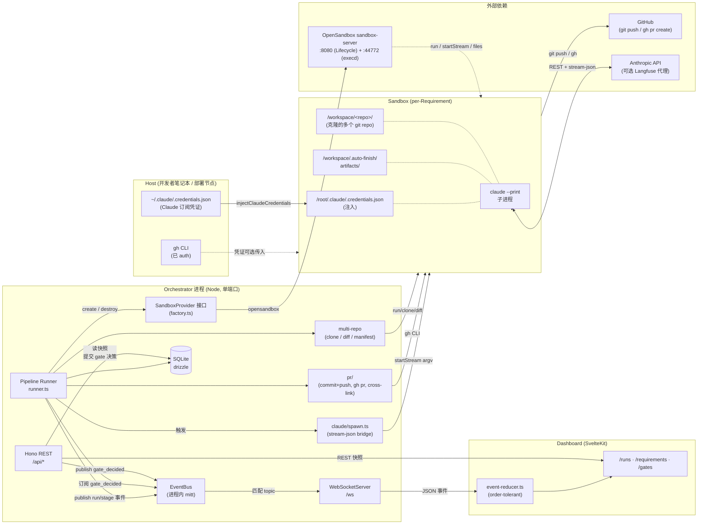
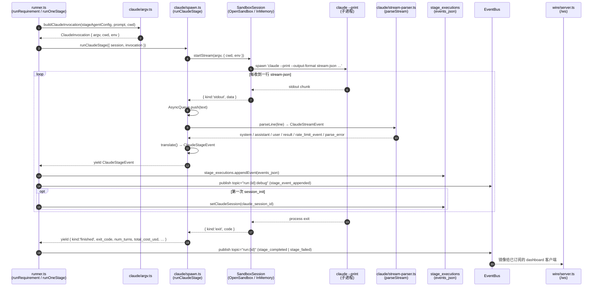

# auto-finish 系统架构

> 配套阅读：仓库根目录 `CLAUDE.md`（开发者协作约定）、`examples/default-pipeline.yaml`、`examples/default-project.yaml`。
>
> 本文不引行号，统一以 `文件::符号` 形式给出代码锚点，避免随重构腐化。

---

## 0. 一页概览

`auto-finish` 是一个**驱动 Claude Code 子进程跑流水线**的编排器：

> 单条需求 (Requirement) → 在沙箱里克隆若干 git 仓库 → 按 Pipeline 顺序跑多 Stage（需求分析 / 方案设计 / 实施 / 验证）→ 每个 Stage 都是一次 `claude --print` 子进程 → 中间可在 Gate 处暂停等待人工 → 最终 detect diff 并跨仓开 PR、互相交叉链接。

它是 pnpm workspace monorepo：

| 包 | 角色 |
|---|---|
| `apps/orchestrator` | Hono REST + WebSocket（同进程同端口）+ SQLite + 流水线 runner + Sandbox 抽象 |
| `apps/dashboard` | SvelteKit + Tailwind v4 UI；REST 取快照、WS 流增量事件，本地 reducer 推导 run 状态 |
| `packages/project-schema` | `ProjectConfig` / `SandboxConfig` / `ClaudeConfig` 的 Zod schema + YAML parser |
| `packages/pipeline-schema` | `Pipeline` / `Stage` / `Gate` 的 Zod schema + YAML parser |

进程模型：**一个 Node 进程，两个入口共用同一 `http.Server`**。`apps/orchestrator/src/wire/server.ts::startServer` 把 Hono app 挂在 REST 上，并自己接管 `upgrade` 事件路由到 `WebSocketServer`（`/ws` 路径），WS 鉴权失败用自定义 close code **`4401`** 与 1006 区分。

### 0.1 模块与数据流总览



读图要点：

- **唯一进程边界 = Orchestrator 容器**。Runner / EventBus / DB / Sandbox 抽象都在同一个 Node 进程里，没有 IPC、没有跨进程消息队列。
- **唯一对外 socket = 1 个 HTTP 端口**：REST 与 WS 共用 `http.Server`，dashboard 只配一个 base URL。
- **凭证两条线、绝不互相替换**：Claude 订阅凭证从 host 注入沙箱给 `claude` 用；GitHub 用 `gh auth`（host 上现成或通过 setup_commands 透传），不混用。
- **Sandbox 是一次性的**：一条 requirement = 一个 session，run 收尾或 cold-restart 都会 `destroy()`。

---

## 1. Claude CLI 在流水线中的调用链（核心）

> 这一节回答："Stage 真正怎么跑起来"。

### 1.1 一次 Stage 的端到端时序



### 1.2 argv 拼装（`claude/argv.ts::buildClaudeInvocation`）

为了让 stream-json 输出稳定可被 `parseStream` 消费，argv 是确定性顺序拼装的：

```
claude
  --print --output-format stream-json --include-partial-messages --verbose
  --append-system-prompt "<systemPrompt>"
  --allowedTools=Read,Write,Edit,Grep,Glob,Bash(git:*)
  --model=<model>?
  --add-dir=<dir>?       (可重复)
  --max-turns=<n>?
  "<userPrompt>"          ← 最后一个位置参数
```

非显而易见的硬约束：

| 约束 | 原因 |
|---|---|
| `--print --output-format stream-json --include-partial-messages --verbose` 四旗必须**同时**存在 | 真抓包验证：headless 模式下流式 JSON 必须 `--verbose`；缺一会立刻 SIGSEGV/无输出 |
| `--allowedTools=A,B,C` 必须 `=` 形式 + 逗号拼接 | CLI 把空格分隔的 `--allowedTools Read Write` 视作 flag+第一值+多余位置参数，会**静默丢弃**除第一个之外的所有工具 |
| `--append-system-prompt` 用两参数形式 | system prompt 经常多 KB，避免自定义转义层 |
| 默认 `max_turns = 25`（runner.ts 里的 `DEFAULT_MAX_TURNS`） | 上游 CLI 默认 50；smoke 测试中过于宽松，被刻意收紧。Stage 自己设了就不覆盖 |
| Stage 的 `agent_config` 在 runner 里被**克隆**后再注入 default max_turns | Pipeline 快照需保持不变，重跑可复现 |

### 1.3 凭证注入（`claude/credentials.ts::injectClaudeCredentials`）

策略：**host_mount，订阅优先**。

1. Host 端解析顺序：显式 `hostCredentialsPath` > `~/.claude/.credentials.json` > `~/.config/claude/.credentials.json`。
2. 上传到 Sandbox 默认路径 `/root/.claude/.credentials.json`。
3. `chmod 0600`（best-effort：minimal alpine 没有 chmod 时只 warn 不 fail）。

设计决策（已沉淀进 memory）："**任何涉及 Claude 模型调用的新设计，默认走 `claude` CLI + 订阅凭证，而不是 SDK + API key**"。原因：用户用的是 Claude Pro / Max 订阅，订阅在 CLI 层已能复用，写 SDK 就回退成额度独立的 API 调费。

`ANTHROPIC_BASE_URL` 设了的话，CLI 调用会被代理到 Langfuse 抓取，但凭证仍是订阅 token。

### 1.4 子进程桥接（`claude/spawn.ts::runClaudeStage`）

`SandboxSession.startStream` yield 出 `{kind:'stdout'|'stderr'|'exit'}`，但 `parseStream` 想要的是 `AsyncIterable<string>`（仅 stdout）。spawn 模块用一个**自写 `AsyncQueue`** 桥接：

```
startStream  ──┬──► AsyncQueue (push stdout text, close on exit)
               ├──► stderrSink (process.stderr 默认)
               └──► exitCode 局部变量
                       │
parseStream(queue) ────┴──► ClaudeStreamEvent (zod 校验/降级)
        │
        ▼
   translate()  ──►  ClaudeStageEvent (业务事件)
        │
        ▼
   yield 到 runner
```

`AsyncQueue` 的不变量：**任何时刻要么 buffer 有元素、要么有 pending waiter，二者不并存**。`push` 看到 waiter 直接 handoff；`next()` 看到 buffer 直接出队；`close()` 把所有挂起 waiter 用 `done:true` 解决——这是为什么 `for await ... of parseStream(queue)` 能干净地结束循环。

终止事件契约：**`runClaudeStage` 必然 yield 唯一一次终止事件**——`finished`（不论 exit_code）或 `failed`（不可恢复的会话错误）。`finished` 上会挂 last `result` 事件里的 `total_cost_usd / num_turns / duration_ms / usage`。

### 1.5 stream-json 解析（`claude/stream-parser.ts::parseStream`）

- 输入支持 `AsyncIterable<string>`、`AsyncIterable<Uint8Array>`、Node `Readable`。
- 字节流走 `TextDecoder('utf-8', { stream: true })`，跨 chunk 的多字节 UTF-8 序列被正确处理。
- 按 `\n` 分行，行内 JSON 解析失败 → 合成 `parse_error` 事件继续，**永不抛异常打断流**。
- `type` 字段已知（`system`/`assistant`/`user`/`result`/`stream_event`/`rate_limit_event`）走严格 zod 校验，schema 漂移立即变成 `parse_error`；未知 `type` 走 `UnknownEventSchema` 透传，未来 Anthropic 加新事件不会炸。

### 1.6 事件翻译与持久化（`claude/spawn.ts::translate` + `runner.ts::runOneStage`）

`ClaudeStreamEvent` → `ClaudeStageEvent` 的核心转换（见 `claude/stage-event.ts`）：

| 原始 `type` / 子类型 | 翻译为 `ClaudeStageEvent.kind` | 备注 |
|---|---|---|
| `system` `subtype:init` | `session_init` | 提取 `session_id / model / tools` |
| `assistant` 内 `text` block | `assistant_text` | |
| `assistant` 内 `tool_use` block | `tool_use` | 携带 `id / tool / input` |
| `assistant` 内 `thinking` block | （丢弃） | 对 dashboard 不可操作 |
| `user` 内 `tool_result` block | `tool_result` | content 防御性 stringify |
| `rate_limit_event` | `rate_limited` | 尝试提取 `reset_at` |
| `result` | （不 yield，stash 到 finished） | 终态指标走 finished |
| `parse_error` | `parse_error` | 透传，便于 ops 看 schema drift |
| `stream_event` (partial SSE) | （丢弃） | 暂不需要打字机式 UI |

每个 stage 事件在 runner 里会被**双发**：

1. **持久化**：`stage_executions.appendEvent(events_json)` —— 数据库审计 / 重放权威源。
2. **镜像 bus**：`bus.publish(topic="run:{id}:debug", { kind:'stage_event_appended', ... })` —— `wire/server.ts` 桥接到 WS。**默认 dashboard 订阅 `run:{id}` 收不到** debug 事件流（topic 精确匹配），developer view 显式订阅才看得到，避免高频流量打爆默认视图。

第一次 `session_init` 还会触发 `stage_executions.setClaudeSession(claude_session_id)`——把 session id 升到列上，dashboard / 调试脚本不必扫 events_json 就能 grep。

---

## 2. 流水线 Runner 主循环（`runner.ts::runRequirement`）

总体步骤（异常路径见 §3）：

```
1. 加载聚合: requirement → project → repos → pipeline (DB 五连查)
2. provider = makeSandboxProvider(project.sandbox_config_json)
   session  = provider.create(buildSandboxCreateConfig(...))
3. injectClaudeCredentials(session)
4. cloneRepos + writeManifest（同 sandbox 下多 repo 并排放在 /workspace/<name>）
5. 跑 setup_commands（在 clone 之后，第一个 stage 之前）
6. for stage in plan.stages:
   stage_executions.create(status='running')
   invocation = buildClaudeInvocation(...)
   outcome    = runOneStage(...)            ← §1 时序图整段在这里
   if outcome.failed:
       Tier-2 cold-restart 决策（§3）
       否则按 stage.on_failure 处理 (pause/retry/abort)
   if stage.has_gate:
       captureDiffArtifacts(stage_execution_id)   ← gate 页面给人 review 用
       publish gate_required
       finishStageExecution(status='awaiting_gate')
       waitForGateDecision(...)            ← bus + DB poll 双信号 race
       publish gate_decided
       if rejected:
           finishStageExecution(status='awaiting_changes')
           return                          ← 不发 stage_completed（语义：没真完成）
       finishStageExecution(status='completed')
       publish stage_completed
   else:
       finishStageExecution(status='completed')
       publish stage_completed
7. detectChanges + captureDiffArtifacts（最终快照，挂在 last successful stage）
8. publishPullRequests（commit+push 并行 → 顺序开 PR → phase-2 互相 cross-link）
9. 标记 requirement.completed / pipeline_run.finished / publish run_completed
finally:
   session.destroy()  （吞错，不能盖住真实结果）
```

### 2.1 Gate 事件序：Fix #13 Option A

Gated stage 的事件顺序刻意区分**通过路径**和**驳回路径**，让消费者 grouping by `stage_completed` 时语义干净：

| 路径 | 事件序 |
|---|---|
| 通过 | `stage_started → … → gate_required → gate_decided(approved) → stage_completed` |
| 驳回 | `stage_started → … → gate_required → gate_decided(rejected)` （**无 `stage_completed`**） |

驳回时 run 进 `awaiting_changes`，stage 行的状态写为 `awaiting_changes`。dashboard 的 `event-reducer.ts` 是 **order-tolerant 的**——事件可以乱序到达（WS 重连等），reducer 用 idempotent 推导，不依赖严格时序。

### 2.2 Gate 唤醒：bus subscribe + DB poll 双 race（`runner.ts::waitForGateDecision`）

```
                 ┌──── busPromise (subscribe run:{id}, kind='gate_decided')
   Promise.race ─┤
                 └──── pollPromise (每 1s 读 gate_decisions 表)
```

关键时序细节：**先订阅再查 DB**。否则 "查完 → 决策落表 → 才订阅" 之间的 TOCTOU 窗口里若决策已到，会永远卡住。订阅完成立刻读一次 DB（应付 crash 后重启读到既存决策的场景），然后才进 poll 循环。

24h 硬上限——超时抛错。

### 2.3 Stage 失败处理矩阵

| `stage.on_failure` | 行为 |
|---|---|
| `pause` | finishStageExecution(failed) → run_paused → 操作员介入 |
| `cold_restart` | 先尝试 Tier-2 cold-restart（§3）；同 stage 第二次失败降级为 `pause` |
| `retry` | MVP 未支持，按 `abort` 处理（throw → run_failed）|

dep-install 失败签名（`runner/warm-fallback.ts::DEP_FAILURE_PATTERNS`）即使 `on_failure != cold_restart` 也会自动触发一次 cold-restart：`/Read-only file system/`、`/EACCES.*(?:node_modules|\.venv|\.m2|site-packages|\.cargo)/`。

---

## 3. Sandbox 抽象与 warm 策略

### 3.1 `SandboxProvider` / `SandboxSession` 契约（`sandbox/interface.ts`）

```ts
interface SandboxProvider {
  create(config: SandboxConfig): Promise<SandboxSession>;
}
interface SandboxSession {
  readonly id: string;
  run(argv, opts?): Promise<RunResult>;            // 一次性
  startStream(argv, opts?): AsyncIterable<StreamEvent>;  // 用于 claude
  readFile / writeFile / uploadFile;
  destroy(): Promise<void>;                        // 幂等
}
```

`startStream` 必须以**恰好一次** `{ kind:'exit' }` 收尾（除非消费者提前 break），且 break 必须能彻底清理子进程，不能泄漏。这是 §1.4 `runClaudeStage` 能正确写出 finished 事件的前提。

### 3.2 实现（`sandbox/factory.ts::defaultMakeSandboxProvider`）

| `provider` | 类 | 用途 |
|---|---|---|
| `opensandbox` | `OpenSandboxProvider`（基于 `@alibaba-group/opensandbox` SDK；Lifecycle API :8080 + 每沙箱 execd :44772）| 生产默认 |
| `in_memory` | `InMemoryProvider` | 测试参考，**字节级忠实**——OpenSandbox 已知有 stdout 末尾换行丢失等差异 |

OpenSandbox 与 in-memory 的已知偏差全部记录在 `opensandbox-provider.ts` 头注里。dashboard / Claude CLI 都按行处理，换行丢失不会暴露。

### 3.3 Warm strategy（三档 + Tier-2 fallback）

`project.sandbox_config.warm_strategy ∈ { baked_image, shared_volume, cold_only }`。

| 策略 | 说明 | 必填 |
|---|---|---|
| `cold_only` | 安全默认，每次冷启 | 无 |
| `baked_image` | 直接用 `warm_image`（代码 + 依赖已烘焙）| `warm_image`、`base_image`（fallback 用）|
| `shared_volume` | 通用 image + 把 deps cache 当 `VolumeBinding` 挂进来 | `warm_volume_claim`、`warm_mount_path`、`warm_volume_backend ∈ {host,pvc}`（`ossfs` 暂未实现，会 throw）|

`runner.ts::buildSandboxCreateConfig` 是 schema → low-level `SandboxConfig` 的物化函数；`buildColdSandboxConfig` 是 fallback 时**剥离 warm**版本（baked → 用 base_image；shared_volume → 丢 volumes 让 agent 自己装）。

### 3.4 Tier-2 cold-restart（`runner/warm-fallback.ts`）

触发条件（任一）：

1. `stage.on_failure === 'cold_restart'`
2. stage 事件里命中 `DEP_FAILURE_PATTERNS`（保守白名单）

且**该 stage 此前未重启过**（`restartedStages` 集合保证）。第二次失败降级为 `pause`，杜绝死循环。

执行步骤：

```
1. 给失败那行 stage_execution append 一条合成事件 'cold_restart'（审计边界）
2. finishStageExecution(failed) ← 旧行就此封板
3. publish kind='cold_restart'   ← reducer 视为 no-op，run 仍然 running
4. snapshotArtifacts(session)    ← 读 /workspace/.auto-finish/artifacts/** 进内存
5. session.destroy()
6. session = provider.create(buildColdSandboxConfig(...))
7. injectClaudeCredentials + cloneRepos（重新拉一遍）
8. restoreArtifacts(session, snapshot)
9. continue（不递增 stageIdx，下一轮新建一行 stage_executions 重跑同 stage）
```

Snapshot 是**内存级**的；orchestrator 自己 crash 会丢——属于 Phase 2 的 crash-resume 范畴。

---

## 4. 多仓 git diff / PR 编排（陷阱密集区）

### 4.1 `git diff <base>` 不要写成 `<base>...<branch>`

`multi-repo/diff.ts` 故意用 `git diff <base>`（无三点）。原因：

```
runner 的工作流是 →  clone  →  Claude 用 Edit/Write 改工作树（不 commit）  →  detectChanges  →  PR
                                              ^^^^^^^^^^^^^^^^
                                  这一段没有 commit，三点形式（commit-range）会全空
```

`git diff <base>` 比对工作树 vs base，捕获**已 commit + 未 commit** 差异——和 PR 实际展示的语义一致。

**已知约束**：`git diff` 抓不到全新未跟踪文件。Stage 创建全新文件时需要先 `git add -A`。**不要把这里"修"成三点形式**。

### 4.2 PR 编排（`pr/orchestrate.ts::publishPullRequests`）

```
1. 过滤 has_changes=true 的 repo
2. 并行 commit + push（不同 repo 互不影响状态）
3. Phase-1: 用 'pending' 占位互链生成初始 body，顺序 gh pr create（rate-limit 友好 + 顺序确定）
4. Phase-2: 已有所有 PR URL，rebuild body 用真实 URL，gh pr edit 回填
5. Phase-2 best-effort：单条 edit 失败只 warn，**不丢弃已开的 PR 记录**
                       （否则 caller catch 掉就丢失了真上线的 PR 引用）
```

### 4.3 Diff 工件双发

`runner.ts::captureDiffArtifacts` 在两处调用：

1. **Gate 等待前**：把 patch 写入 `artifacts(type='diff')`，gate 页面有完整 diff 给人 review。
2. **Run 末尾**：detectChanges 后再写一次，挂在 last successful stage 上，dashboard PR/finished 视图能直接看 patch。

artifacts 表见 `db/schema.ts::artifacts`；`storage_uri='inline://'` 表示内容直接放在 `content` 列里（小 patch 走这路；大对象走外部存储是后续工作）。

---

## 5. 数据模型与 EventBus

### 5.1 DB schema 关键不变量（`db/schema.ts`）

- 所有 ID 是字符串 PK，`crypto.randomUUID()` 默认填充。
- 时间戳是 unix-ms 的 `integer`，**不是** drizzle `timestamp_ms` 模式（要的是干净 JSON）。
- JSON 列：`text({ mode: 'json' }).$type<…>()`；`$type` 仅类型层，运行期校验在 repository 层。
- FK 级联策略：`pull_requests` 保留审计 (`ON DELETE RESTRICT`)；`runs / stage_executions` 走 `CASCADE`。

主要表：

```
projects ─┬─< repos
          └─< requirements ─< pipeline_runs ─< stage_executions ─┬─< gate_decisions
                                                                  ├─< artifacts
                                                                  └─ claude_session_id
              └─< pull_requests (run_id FK, RESTRICT)
pipelines  ←── (referenced by) requirements.pipeline_id；snapshot 在 pipeline_runs.pipeline_snapshot_json
```

### 5.2 EventBus（`eventbus/bus.ts::EventBus`）

特点：

- **进程内同步 fan-out**——`mitt` 包装，`subscribe(filter, handler)`，topic 精确匹配 + 逗号 + `*` 通配。
- 抛错的 handler 被 catch 到 `console.error`，不影响兄弟订阅者。
- `asyncIterable(filter, { maxQueueSize=1000 })` 给纯异步消费者用，**drop-oldest backpressure**——队列满优先保留新事件。
- Gate 路由 publish `gate_decided` 与 runner 订阅在**同一个 `EventBus` 实例**上（`wire/server.ts` 把同一个 `bus` 注进 `buildApp` 和 runner 依赖），所以 gate 决策落地后 runner 的 `waitForGateDecision` 在微秒级被叫醒，DB poll 仅作 multi-process / 测试旁路时的兜底。

### 5.3 WS 桥接协议（`wire/server.ts::attachBusBridge`）

```
client → server:  {"type":"subscribe","filter":"run:abc,gate:pending"}
server → client:  {"type":"subscribed","filter":"<echo>"}
server → client:  {topic, event, emitted_at}     (匹配的每条 BusMessage)
client → server:  {"type":"ping"}
server → client:  {"type":"pong","at":"<ISO>"}
```

**鉴权失败用 close code `4401`**（`AUTH_REJECTED_CLOSE_CODE`）——upgrade 完成后再 `ws.close(4401)`，避免 raw-socket destroy 让客户端只看到 1006 与"网络断了"无法区分。

每个连接**只允许第一次 subscribe**——防止客户端悄悄叠加更宽 filter 偷收事件。

### 5.4 PipelineEvent 全集（`pipeline/events.ts`）

```
run_started / run_completed / run_failed / run_paused
stage_started / stage_completed / stage_failed / stage_artifact_produced
gate_required / gate_decided
cold_restart                       ← Tier-2 fallback 边界，reducer 视为 no-op
stage_event_appended               ← 高频，仅 run:{id}:debug 主题，dev view 才订阅
```

dashboard 的 `event-reducer.ts` 用 exhaustive `switch (ev.kind)`（`default: never`），`pipeline/events.ts` 加新成员而 dashboard 没跟上时 type-check 就炸——保持双端一致。

---

## 6. HTTP API 表面（`api/app.ts::buildApp`）

每个路由模块 `routes/*.ts` 挂 `/api/<segment>`：

| 路径 | 关键能力 |
|---|---|
| `/api/projects` | CRUD project + 嵌入 sandbox/claude config |
| `/api/pipelines` | YAML 上传 + Pipeline CRUD |
| `/api/requirements` | 创建需求、列表、按 status 过滤、触发 run |
| `/api/runs` | run 详情 + stage_executions 列表 + events_json |
| `/api/gates` | 列待决 gate、提交 `approve` / `reject(feedback?)`（同时 publish `gate_decided`）|
| `/api/artifacts` | 单 artifact 取件（含 diff 的 inline content）|
| `/healthz` | liveness |

JSON 错误处理器**不漏 stack trace**——客户端只看到 `{ error, message }`，详细错误进 server log。

---

## 7. 一些"必须知道、grep 不出来"的约定

按踩坑成本排序：

1. **`pnpm -r build` 必须先于 `pnpm -r typecheck`**：workspace 包的 `package.json` 指向 `./dist/*.{js,d.ts}`，`dist` 不存在时 orchestrator 解析不到 `@auto-finish/pipeline-schema`，给一片 `TS2307`。CI 顺序也是这个原因。
2. **`verbatimModuleSyntax`** 全开：类型导入必须 `import type { Foo } from '…'`，不会自动 elide。
3. **`noUncheckedIndexedAccess`** 全开：`a[i]` 类型是 `T | undefined`，要先收窄。`runner.ts` 里大量 `as RepoSpec` 都是这个原因。
4. **NodeNext + ESM**：workspace 包输出是 `.js` 扩展名的 ESM 模块，运行期必须显式带后缀。
5. **`MAX_CONCURRENT_REQUIREMENTS` 默认 5**：所有沙箱共用同一份 Claude 订阅凭证，并发上限就是这个。
6. **smoke harness `pnpm smoke:all`** 在 `apps/orchestrator/scripts/smoke-all.ts`：四脚本顺序跑，缺凭证 → 打印 `SKIPPED: <reason>` 退 0。`scripts/local-provider.ts` 是库不是脚本，**别加进 SCRIPTS 数组**。
7. **OpenSandbox integration test** 默认被 `OPENSANDBOX_INTEGRATION` env 门控跳过：`describe.skipIf(...)`，需要真打 `sandbox-server` 时单独显式打开。

---

## 8. 配置示例对照

### Pipeline（`examples/default-pipeline.yaml`）

四 stage、两 gate：

```
需求分析  ──►  方案设计 (gate: design.md) ──►  实施  ──►  验证 (gate: test-report.md + diff-summary.md)
on_failure: pause     pause                      retry      pause
```

每个 stage 的 `agent_config.system_prompt + allowed_tools` 决定 claude 在那一道工序里能做什么。`allowed_tools` 是白名单，超出会被 CLI 拒绝。

### Project（`examples/default-project.yaml`）

```yaml
sandbox_config:
  provider: opensandbox
  warm_strategy: baked_image
  warm_image: ghcr.io/example-org/example-app:warm
  base_image: ghcr.io/example-org/example-app:base    # cold-restart 兜底必须有
  setup_commands:                                     # clone 之后 / stage 之前跑
    - cd /workspace/frontend && git fetch
    - cd /workspace/backend && git fetch

claude_config:
  credentials_source: host_mount
  credentials_path: ~/.claude/.credentials.json
  allowed_tools: [...]
  mcp_servers:                                        # 见 packages/project-schema
    github: {...}
```

**关于 `setup_commands` 的位置**：早期实现错误地把它丢在 `OpenSandboxProvider.create()` 里（即 clone 之前），导致 `cd /workspace/<repo>` 永远找不到目录。现在统一在 `runner.ts::runRequirement` 第 5 步执行——schema 文档承诺的"after repo clones"语义这里才真兑现。

---

## 9. 一句话总结

> **Runner 把每个 Stage 翻译成一次 `claude --print` 子进程在沙箱里的执行，用 stream-json 把 CLI 的内部事件抠出来，落库 + 上 bus + WS 推到 dashboard；Gate 在事件流里插断点；最后用一个不带三点的 `git diff` 检测每个 repo 的真实改动，并发 commit/push、串行开 PR、phase-2 互相 cross-link。**
